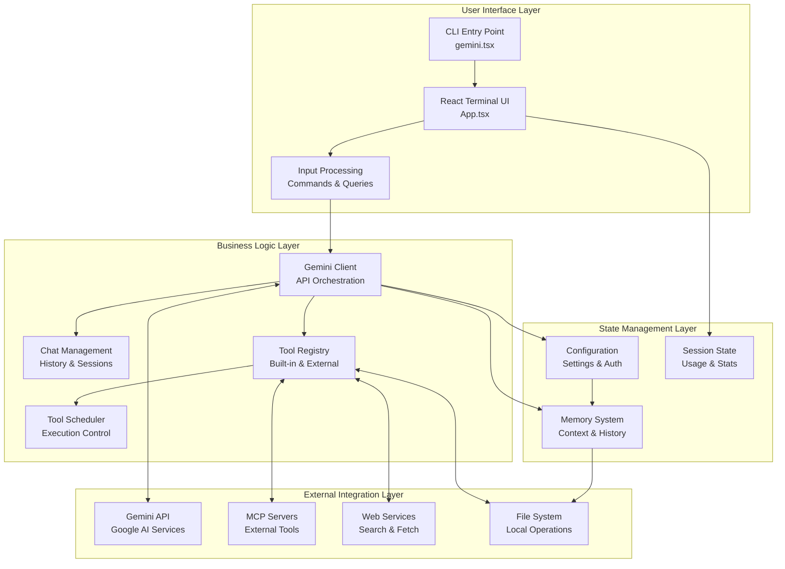
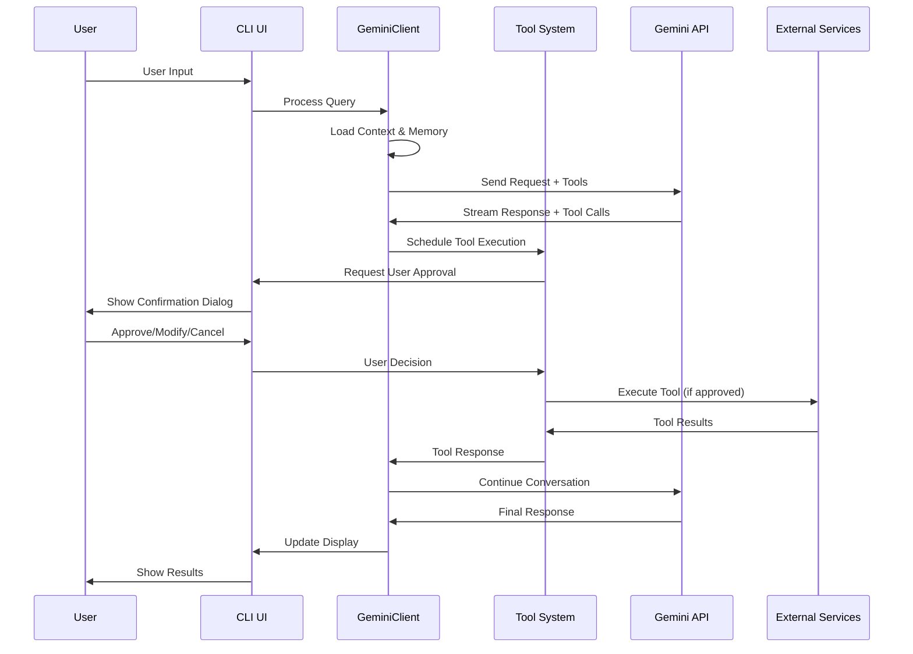
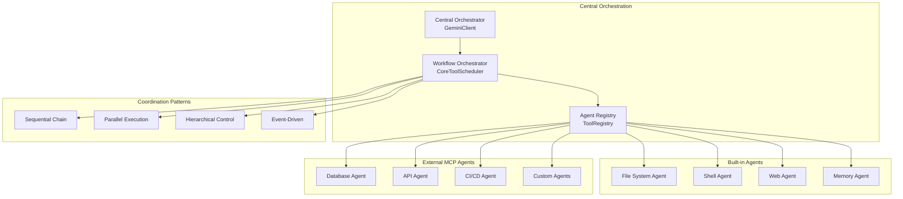
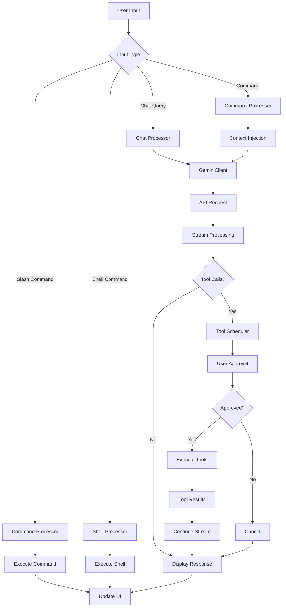
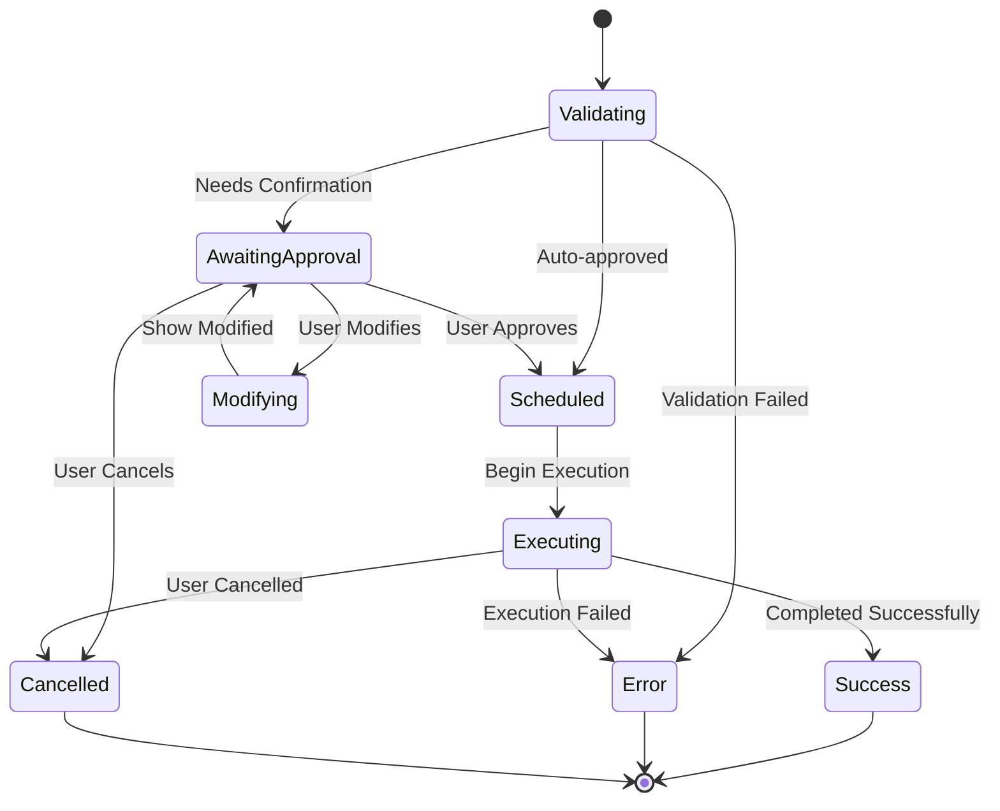
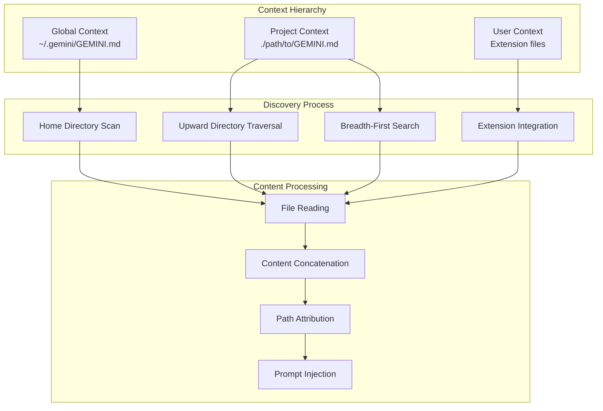
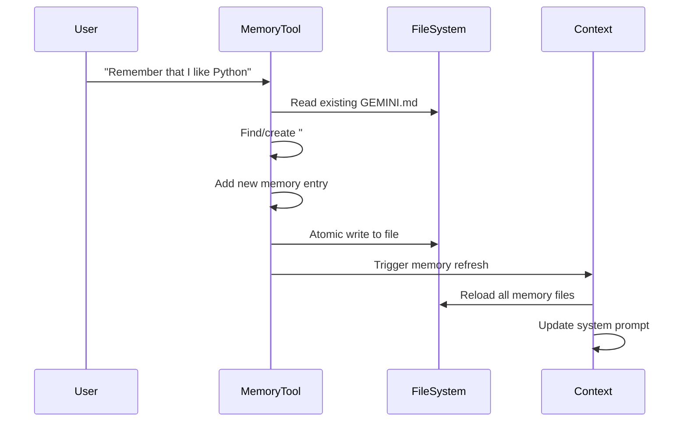
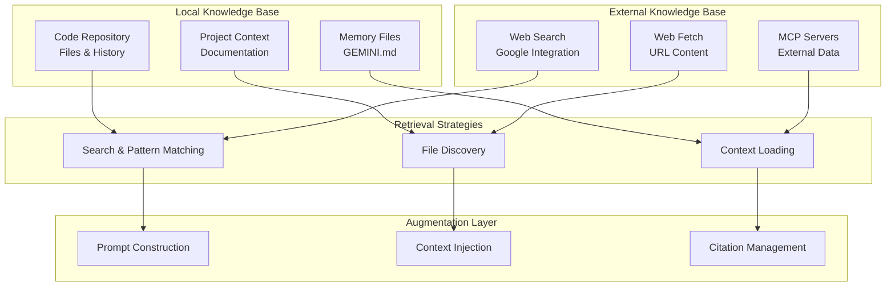
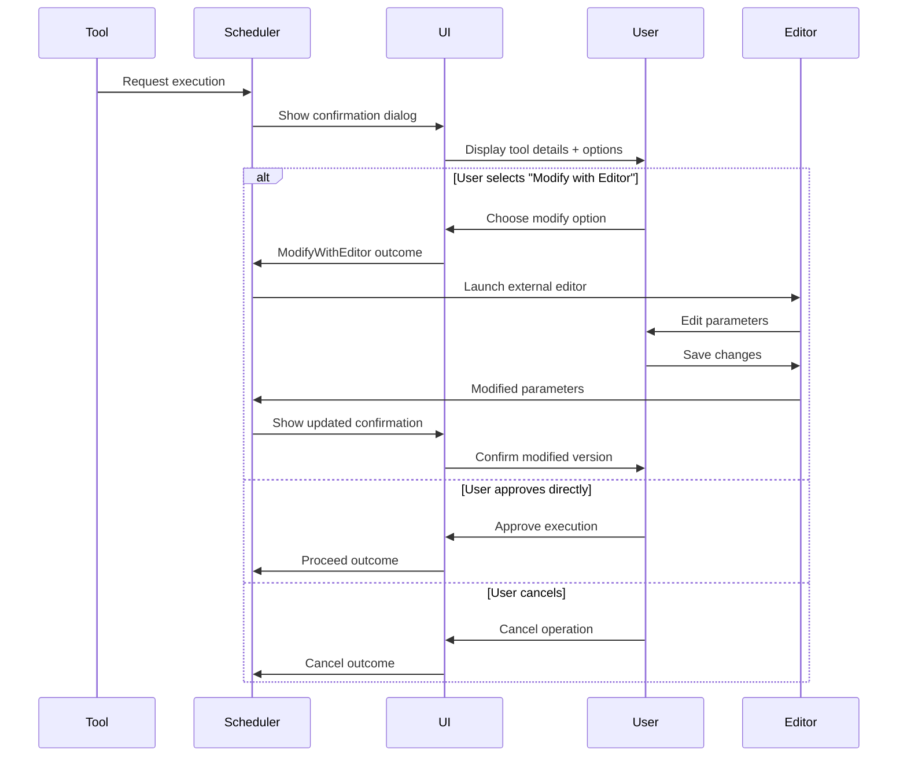

# Gemini CLI Technical Analysis Report
## Comprehensive Multi-Agent System Architecture Analysis

*Generated for Multi-Agent Obsidian System Development*

---

## Executive Summary

This comprehensive technical analysis examines the Gemini CLI project - a sophisticated command-line AI workflow tool that demonstrates advanced multi-agent system architecture patterns. The analysis reveals a highly engineered system that achieves multi-agent-like capabilities through specialized tool architectures, workflow orchestration, external service integration, and sophisticated human-in-the-loop control mechanisms.

**Key Architectural Achievements:**
- **Multi-Agent-Like Behavior**: Through specialized tools and MCP server integration
- **Sophisticated Orchestration**: Central coordination with parallel execution capabilities
- **Advanced Context Management**: Hierarchical memory and context systems
- **Robust Safety Mechanisms**: Multi-level approval and trust management systems
- **Extensible Architecture**: Plugin-friendly design with clear separation of concerns

---

## 1. Project Overview

### 1.1 Project Description
The Gemini CLI is a command-line AI workflow tool that connects to Google's Gemini API to provide AI-powered assistance for software development tasks. It operates as a comprehensive AI assistant capable of:

- Querying and editing large codebases within Gemini's 1M+ token context window
- Generating applications from PDFs, sketches, and multimodal input
- Automating operational tasks like pull request management and complex rebases
- Integrating with external tools and services through Model Context Protocol (MCP)
- Providing grounded responses through Google Search integration

### 1.2 Repository Structure
```
gemini-cli/
├── packages/
│   ├── cli/                    # Frontend/UI Layer
│   │   ├── src/ui/            # React-based terminal UI
│   │   ├── src/config/        # Configuration management
│   │   └── src/utils/         # CLI utilities and sandbox
│   └── core/                  # Backend/Business Logic Layer
│       ├── src/core/          # API client and chat management
│       ├── src/tools/         # Tool system and MCP integration
│       ├── src/config/        # Core configuration
│       └── src/utils/         # Utilities and helpers
├── docs/                      # Comprehensive documentation
├── integration-tests/         # End-to-end testing
└── scripts/                   # Build and deployment scripts
```

### 1.3 Key Metrics
- **Lines of Code**: ~50,000+ lines of TypeScript
- **Packages**: 2 main packages (CLI and Core)
- **Built-in Tools**: 15+ specialized tools
- **Test Coverage**: Comprehensive unit and integration tests
- **Documentation**: Extensive user and developer documentation

---

## 2. Technology Stack & High-Level Architecture

### 2.1 Core Technology Stack

#### **Frontend (CLI Package)**
- **React 18.3.1**: Component-based UI architecture
- **Ink 5.2.0**: Terminal-based React rendering
- **Terminal UI Libraries**: 
  - `ink-spinner`, `ink-text-input`, `ink-gradient`
  - `ink-big-text`, `ink-select-input`, `ink-link`
- **Utilities**:
  - `highlight.js` for syntax highlighting
  - `diff` for file comparison
  - `glob` for file pattern matching
  - `yargs` for command-line parsing

#### **Backend (Core Package)**
- **Google Gemini API**: `@google/genai` (1.4.0)
- **Model Context Protocol**: `@modelcontextprotocol/sdk` (1.11.0)
- **Authentication**: `google-auth-library` (9.11.0)
- **Observability**: OpenTelemetry stack for metrics and tracing
- **Utilities**:
  - `simple-git` for Git operations
  - `undici` for HTTP operations
  - `ws` for WebSocket communication
  - `html-to-text` for web content processing

#### **Development & Build**
- **TypeScript 5.3.3**: Type-safe development
- **ESBuild**: Fast bundling and compilation
- **Vitest**: Testing framework with coverage
- **ESLint + Prettier**: Code quality and formatting
- **Docker/Podman**: Containerized execution environments

### 2.2 High-Level Architecture Diagram



### 2.3 Architectural Principles

1. **Separation of Concerns**: Clear boundaries between UI, business logic, and external services
2. **Modularity**: Plugin-based architecture with well-defined interfaces
3. **Extensibility**: Tool system designed for easy addition of new capabilities
4. **Security**: Multi-layered approval and validation systems
5. **Performance**: Streaming responses and optimized rendering
6. **Observability**: Comprehensive telemetry and error tracking

---

## 3. Key System Components

### 3.1 CLI Package Components

#### **App.tsx - Central UI Orchestrator**
- **Role**: Main React application component managing terminal interface
- **Responsibilities**:
  - Terminal input/output coordination via Ink framework
  - Keyboard event handling (Ctrl+C, Ctrl+D, escape sequences)
  - Stream processing and UI state management
  - Dialog orchestration (themes, authentication, settings)
  - Performance optimization through static/dynamic rendering

#### **Configuration System**
- **Settings Management**: Hierarchical configuration (global → user → project)
- **Theme System**: 10+ customizable terminal themes
- **Authentication**: Multiple auth methods (OAuth, API keys, Service Account)
- **Extension Integration**: Plugin system for additional functionality

#### **Hook System Architecture**
- **useGeminiStream**: Core streaming and tool execution coordination
- **useToolScheduler**: Tool execution lifecycle management
- **useHistoryManager**: Conversation history and session management
- **Command Processors**: Slash commands, shell commands, @ commands

### 3.2 Core Package Components

#### **GeminiClient - Central API Hub**
- **Environment Setup**: Automatic context injection (directory, date, platform)
- **History Management**: Conversation history with validation and compression
- **Tool Integration**: Coordinates with ToolRegistry for function calling
- **Flash Fallback**: Automatic model switching for rate-limited users
- **Context Compression**: Automatic summarization when approaching token limits

#### **GeminiChat - Session Management**
- **Dual History System**: Comprehensive and curated history for reliability
- **Streaming Support**: Real-time message processing
- **Function Call Lifecycle**: Tool request and response coordination
- **Error Recovery**: Robust error handling with retry mechanisms

#### **Tool System Architecture**
- **ToolRegistry**: Central registry with dynamic discovery
- **BaseTool**: Abstract base class for consistent tool interfaces
- **CoreToolScheduler**: Sophisticated execution state machine
- **MCP Integration**: External tool server support

### 3.3 Component Interaction Patterns



---

## 4. Multi-Agent System Architecture

### 4.1 Agent-Like Specialization Through Tools

The Gemini CLI achieves multi-agent-like behavior through a sophisticated tool architecture where each tool acts as a specialized "agent" with distinct capabilities:

#### **Core Agent Types**

**File System Agent** (ReadFile, WriteFile, EditTool, LS, Glob, Grep):
- **Domain**: File system operations and code analysis
- **Capabilities**: Reading, writing, searching, and modifying files
- **Intelligence**: Path validation, encoding detection, diff generation
- **Security**: Directory traversal protection, gitignore respect

**Shell Agent** (ShellTool):
- **Domain**: Command execution and system interaction
- **Capabilities**: Process management, environment control, command execution
- **Intelligence**: Command safety analysis, background process handling
- **Security**: Sandbox execution, process group management

**Web Agent** (WebFetch, WebSearch):
- **Domain**: Internet access and information retrieval
- **Capabilities**: HTTP requests, search operations, content processing
- **Intelligence**: MIME type detection, GitHub URL conversion
- **Security**: Private network handling, URL validation

**Memory Agent** (MemoryTool):
- **Domain**: Long-term memory and context persistence
- **Capabilities**: Fact storage, context retrieval, memory management
- **Intelligence**: Structured markdown storage, deduplication
- **Security**: Atomic file operations, concurrent access handling

#### **External MCP Agents**
The system supports unlimited external agents through MCP (Model Context Protocol) servers:
- **Database Agents**: SQL query execution and data manipulation
- **API Integration Agents**: REST/GraphQL API interactions
- **CI/CD Agents**: Build, test, and deployment automation
- **Custom Domain Agents**: Specialized tools for specific domains

### 4.2 Multi-Agent Orchestration Patterns



### 4.3 Inter-Agent Communication

#### **Event-Driven Architecture**
```typescript
enum GeminiEventType {
  Content = 'content',
  ToolCallRequest = 'tool_call_request',      // Agent requests
  ToolCallResponse = 'tool_call_response',    // Agent responses
  ToolCallConfirmation = 'tool_call_confirmation', // User approvals
  Error = 'error',                           // Agent failures
  UsageMetadata = 'usage_metadata',          // Resource tracking
}
```

#### **State Sharing Mechanisms**
- **Session State**: Shared conversation history accessible to all agents
- **Persistent Memory**: Cross-session context through GEMINI.md files
- **Configuration State**: Shared settings and preferences
- **External State**: MCP server state management

### 4.4 Dynamic Agent Discovery

The system supports runtime agent discovery and registration:

```typescript
// Dynamic MCP agent discovery
async function discoverMcpTools(
  mcpServers: Record<string, MCPServerConfig>,
  toolRegistry: ToolRegistry,
): Promise<void> {
  // Parallel discovery of external agents
  const discoveryPromises = Object.entries(mcpServers).map(
    ([serverName, config]) => connectAndDiscover(serverName, config, toolRegistry)
  );
  await Promise.all(discoveryPromises);
}
```

---

## 5. Data Flow and System Sequences

### 5.1 Complete User Input Processing Pipeline



### 5.2 Streaming Data Flow Architecture

The system implements sophisticated streaming with performance optimizations:

1. **Stream Event Processing**: Real-time processing of API responses
2. **Safe Content Splitting**: Large messages split at safe points to prevent UI flicker
3. **Tool Call Aggregation**: Multiple tool requests batched for efficiency
4. **Live Output Updates**: Real-time feedback during tool execution
5. **Automatic Continuation**: Tool responses automatically submitted back to API

### 5.3 Tool Execution State Machine



---

## 6. Context System Architecture

### 6.1 Hierarchical Context Loading

The system implements a three-tier hierarchical context management:



### 6.2 Context Discovery Algorithm

The memory discovery system uses sophisticated file search:

1. **Global Search**: Check `~/.gemini/GEMINI.md`
2. **Upward Traversal**: From current directory to project root
3. **Downward BFS**: Breadth-first search within project
4. **Git Awareness**: Respects `.gitignore` and repository boundaries
5. **Safety Limits**: Maximum 200 directories scanned

### 6.3 Context Compression Strategy

Intelligent context management when approaching token limits:

```typescript
async tryCompressChat(force: boolean = false): Promise<ChatCompressionInfo | null> {
  const tokenLimit = getTokenLimit(this.model);
  const currentTokens = await this.countTokens();
  
  if (currentTokens >= 0.95 * tokenLimit) {
    // Summarize conversation history
    const summary = await this.generateSummary();
    // Replace full history with compressed version
    this.startChat(compressedHistory);
  }
}
```

---

## 7. Memory System Architecture

### 7.1 Persistent Memory Design

The memory system implements structured, persistent storage using markdown files:

```markdown
# Project Context
Project-specific instructions and context...

## Gemini Added Memories
- User preference: Prefers Python for backend development
- Project detail: Using React with TypeScript for frontend
- Personal info: Works in Pacific timezone
- Technical preference: Prefers functional programming patterns
```

### 7.2 Memory Lifecycle Management



### 7.3 Memory Integration Patterns

- **Automatic Loading**: Memory loaded on startup and after save operations
- **Cross-Session Persistence**: Facts persist across CLI sessions
- **Hierarchical Precedence**: Global → project → user memory ordering
- **Real-time Updates**: Memory refreshed after successful saves

---

## 8. RAG (Retrieval-Augmented Generation) Architecture

### 8.1 Multi-Strategy Information Retrieval

The system implements comprehensive retrieval capabilities:

#### **Code and File Retrieval**
- **Grep Tool**: Pattern-based content search with git integration
- **Glob Tool**: File pattern matching with temporal sorting
- **ReadFile Tool**: Multi-format file reading (text, images, PDFs)
- **File Discovery**: Git-aware file system navigation

#### **Web-based Retrieval**
- **Google Search**: Integrated web search with citation support
- **Web Fetch**: URL content retrieval with fallback mechanisms
- **Grounding Support**: Automatic source attribution and citation

#### **Memory Retrieval**
- **Hierarchical Memory**: Project and global context loading
- **Fact Storage**: Structured persistent memory in markdown
- **Context Discovery**: Automatic discovery of relevant context files

### 8.2 Knowledge Base Architecture



### 8.3 Context Injection and Augmentation

The system augments prompts with retrieved context:

```typescript
function getCoreSystemPrompt(userMemory?: string): string {
  const basePrompt = getBaseSystemPrompt();
  const memorySuffix = userMemory && userMemory.trim().length > 0
    ? `\n\n---\n\n${userMemory.trim()}`
    : '';
  return `${basePrompt}${memorySuffix}`;
}
```

---

## 9. Human-in-the-Loop Control Architecture

### 9.1 Multi-Level Approval System

The system implements sophisticated approval mechanisms:

#### **Approval Modes**
- **DEFAULT**: Requires confirmation for most operations
- **AUTO_EDIT**: Auto-approves after first confirmation per session
- **YOLO**: No confirmations required (dangerous mode)

#### **Confirmation Types**
- **Edit Confirmations**: File modifications with diff previews
- **Execute Confirmations**: Shell commands with safety analysis
- **Info Confirmations**: Data disclosure operations
- **MCP Confirmations**: External tool server operations

### 9.2 Interactive Modification Workflows



### 9.3 Trust and Security Management

#### **Progressive Trust Model**
- **One-time Approval**: Proceed once for this specific operation
- **Tool-level Trust**: Remember approval for this specific tool
- **Server-level Trust**: Trust entire MCP server
- **Pattern-based Trust**: Trust command patterns (e.g., git commands)

#### **Security Boundaries**
- **Path Containment**: All operations restricted to project directory
- **Command Analysis**: Shell commands analyzed for safety
- **Resource Limits**: Timeout and resource constraints
- **Audit Logging**: All tool executions logged for review

---

## 10. Key Implementation Insights

### 10.1 Architecture Patterns

#### **Event-Driven Architecture**
- Stream processing enables real-time user experience
- Tool execution events drive UI updates
- Error events trigger recovery workflows
- Usage events enable telemetry and optimization

#### **State Machine Design**
- Tool execution follows well-defined state transitions
- Clear error handling and recovery paths
- User control points at appropriate state transitions
- Cancellation support throughout execution pipeline

#### **Plugin Architecture**
- Clear interfaces for tool development
- Dynamic discovery and registration
- MCP protocol enables external service integration
- Extension system supports additional functionality

### 10.2 Performance Optimizations

#### **Streaming Optimizations**
- Safe content splitting prevents UI flicker
- Incremental rendering for large responses
- Live output updates for long-running operations
- Efficient event processing pipeline

#### **Memory Management**
- Automatic context compression near token limits
- Efficient memory usage monitoring
- Cleanup of unused resources
- Smart caching strategies

#### **Concurrent Execution**
- Parallel tool discovery and execution
- Non-blocking UI updates
- Efficient resource utilization
- Graceful degradation under load

### 10.3 Developer Experience

#### **Comprehensive Testing**
- Unit tests for all core components
- Integration tests for end-to-end workflows
- Performance tests for optimization
- Security tests for safety validation

#### **Developer Tools**
- Rich debugging capabilities
- Comprehensive logging and telemetry
- Configuration validation and error reporting
- Documentation and examples

#### **Extensibility**
- Clear APIs for tool development
- Plugin system for additional functionality
- MCP support for external integrations
- Theme system for customization

---

## 11. Multi-Agent System Design Recommendations for Obsidian

Based on this analysis, here are key recommendations for your multi-agent Obsidian system:

### 11.1 Architecture Recommendations

#### **Adopt Tool-Based Agent Architecture**
- Create specialized "agents" as tools/plugins for different domains
- Implement a central orchestrator for coordination
- Use event-driven communication patterns
- Support dynamic agent discovery and registration

#### **Implement Hierarchical Context Management**
- Global → workspace → note-level context hierarchy
- Automatic context discovery through vault scanning
- Structured memory persistence in markdown format
- Context compression strategies for large vaults

#### **Build Robust Human-in-the-Loop Controls**
- Multi-level approval system for different operation types
- Interactive modification workflows
- Progressive trust building
- Clear security boundaries and validation

### 11.2 Obsidian-Specific Adaptations

#### **Vault-Aware Context System**
- Scan vault structure for relevant notes and context
- Respect vault settings and ignored files
- Support for different note formats and plugins
- Link graph awareness for context relevance

#### **Note-Centric Agent Specialization**
- **Research Agent**: Web search and information gathering
- **Writing Agent**: Content generation and editing
- **Organization Agent**: Note structuring and linking
- **Analysis Agent**: Note analysis and insights
- **Integration Agent**: External service connections

#### **Obsidian Plugin Integration**
- Use Obsidian's plugin API for deep integration
- Support for existing plugin ecosystem
- Consistent UI/UX with Obsidian's design patterns
- Workspace and pane management

### 11.3 Technical Implementation Strategy

#### **Core Architecture Components**
1. **Agent Registry**: Central registry for all available agents
2. **Task Orchestrator**: Coordinates multi-agent workflows
3. **Context Manager**: Manages vault context and memory
4. **Approval System**: Human-in-the-loop controls
5. **Extension API**: Support for custom agents and integrations

#### **Data Flow Patterns**
1. **User Intent → Task Decomposition → Agent Assignment**
2. **Parallel Agent Execution → Result Aggregation → User Review**
3. **Context Loading → Prompt Augmentation → LLM Processing**
4. **Real-time Updates → Progress Tracking → Completion Notification**

#### **Integration Points**
1. **Obsidian API**: Core plugin integration
2. **LLM APIs**: Support for multiple model providers
3. **External Services**: Web search, file processing, etc.
4. **User Interface**: Command palette, modals, and panels

---

## 12. Conclusion

The Gemini CLI represents a sophisticated approach to multi-agent AI system architecture. Its success lies in:

1. **Clear Separation of Concerns**: UI, business logic, and external services are cleanly separated
2. **Extensible Design**: Plugin architecture supports unlimited expansion
3. **Safety First**: Comprehensive approval and validation systems
4. **User Experience**: Smooth, responsive interface with real-time feedback
5. **Reliability**: Robust error handling and recovery mechanisms

For your multi-agent Obsidian system, the key insights are:

- **Tool-based agents** can achieve multi-agent-like behavior effectively
- **Hierarchical context management** scales to large knowledge bases
- **Human-in-the-loop controls** are essential for user trust and safety
- **Event-driven architecture** enables responsive, real-time experiences
- **Progressive complexity** allows users to grow with the system

The Gemini CLI provides an excellent architectural foundation that can be adapted for Obsidian's unique requirements while maintaining the sophistication and reliability needed for a production multi-agent system.

---

*This analysis was conducted through comprehensive codebase examination, focusing on architectural patterns, implementation details, and design principles that enable effective multi-agent system behaviors. The insights and recommendations are based on proven patterns demonstrated in this production-ready system.*